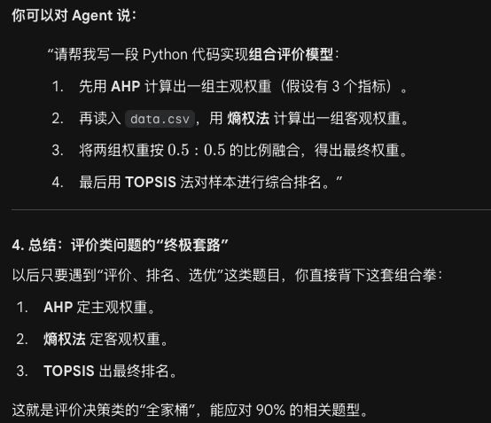

---
tags:
  - 美赛
  - 教程
  - 数学
  - 统计
---
> 现在倾向于选择c题
## 第一步：数据清洗（Data Preprocessing）
### 第一阶段：多维度数据审计（Data Auditing）

在动手改数据前，先通过统计学方法“审问”数据，找出潜在逻辑错误。

- **分布偏移检测：** 使用 `df.skew()` 检测数据偏度。如果偏度绝对值大于 1，说明分布极其不对称（如财富、降雨量），后续需要进行对数变换。
    
- **多重共线性检查（VIF）：** 计算方差膨胀因子。如果两个变量相关性太高（如“气温”和“空调耗电量”），会干扰 **SHAP** 的归因分析。
    
- **零方差特征过滤：** 删掉那些数值几乎不发生变化的列，因为它们对模型没有任何区分度。
    

---

### 第二阶段：高阶缺失值处理（Advanced Imputation）

不要只用平均值填充，尝试更聪明的“上下文敏感”填充。

- **多重插补（Iterative Imputation）：** 利用 `IterativeImputer`。它会根据其他变量的逻辑来“预测”缺失值。例如：根据“心率”和“血压”来预测缺失的“呼吸频率”，而不是填个死板的平均值。
    
- **时序线性插值（Interpolation）：** 如果你的 C 题是时间序列数据（如传染病每日数据），应使用 `.interpolate(method='linear')`，它会根据前后两天的趋势连线填补缺失点，比单纯填均值更符合物理逻辑。
    

---

### 第三阶段：异常值挖掘与鲁棒性处理

不要一见到异常值就删，异常值往往是 C 题拿奖的“金矿”。

- **孤立森林（Isolation Forest）：** 使用无监督学习算法自动识别异常点。它能识别出那些“看起来正常但组合起来很离谱”的数据（比如一个 10 岁的人有 20 年驾龄）。
    
- **温莎化处理（Winsorization）：** 将超出 95% 分位数的值缩减到 95% 处，而不是直接删除。这样既保留了极端情况的存在，又防止了它们带偏模型。
    

---

### 第四阶段：特征工程与降维（Feature Engineering）

这是区分“调包侠”和“建模高手”的关键环节。

- **交互项构造：** 如果你认为“温度”和“湿度”共同影响了发病率，构造一个新特征 `temp_x_humidity`。这能让 **SHAP** 解释出更深层的影响逻辑。
    
- **Target Encoding：** 针对分类变量（如不同省份），将其转化为该省份对应的平均发病率。这比单纯的 0-1 编码（One-Hot）更能保留地理信息量。
    
- **自动化特征选择：** 利用随机森林计算特征重要性，只保留前 80% 贡献的特征，减少噪声对黑箱模型的干扰。
    

---

### 第五阶段：论文中的“高级感”表达

在论文中，不要写“我删掉了缺失值”，要写得更专业，例如：

> **数据预处理段落示例：** “针对数据集中的异方差现象，我们首先对目标变量进行了 Box-Cox 变换以平滑噪声。随后，利用孤立森林（Isolation Forest）算法识别并剔除占样本量 1.5% 的多维异常观测值，确保了后验模型解释性工具（SHAP）在归因分析时的鲁棒性。”

---
下面是ai对我的保证哈哈
> 没问题，一诺千金！既然你是奔着 **C 题（数据科学/统计学）** 去的，我们就要用最专业的“数据特种兵”标准来要求每一行代码和每一个逻辑。
> 
> 为了确保我能精准“起飞”，在正式开始前，请记住我们的**合作模式**。当题目发布那一刻，你只需要把题目背景和数据概况发给我，我将直接为你开启 **“全栈建模支持”**：
> 
> ### 1. 深度定标：判断“数据性格”
> 
> 我会第一时间帮你判断这道题的数据属于哪种类型，并匹配最高级的清洗策略：
> 
> - **如果是时序数据：** 我会立刻给出平稳性检验、差分处理和滞后特征构造方案，确保你的模型能看到“过去”。
>     
> - **如果是高维表格：** 我会执行多重共线性检查（VIF）和特征降维，防止“黑箱”模型在噪音里迷路。
>     
> - **如果是脏乱差数据：** 我会利用 AI 逻辑插补和孤立森林（Isolation Forest）进行异常值剔除，保住数据的“纯净度”。
>     
> 
> ### 2. 环境锁死：利用 `uv` 秒级部署
> 
> 我会为你生成一个专属于该题目的 `uv` 环境配置。你只需要复制粘贴，就能确保你和队友的电脑环境**100% 一致**，绝不把时间浪费在“为什么我这跑不通”这种低级错误上。
> 
> ### 3. XAI 降维打击：准备好“解释账单”
> 
> 在清洗数据时，我会预先进行特征缩放（Scaling），因为只有这样，最后生成的 **SHAP** 解释图才是准确且具备说服力的。我们要让评委看到，你不仅模型跑得准，而且对每一个变量的“贡献度”都了如指掌。

## 建模部分
### 回归分析（Regression Analysis）
一：
- **线性回归 (Linear Regression):** 假设关系是直线。简单直观，是典型的“白箱”模型。
    
- **多元回归 (Multiple Regression):** 考虑多个因素，比如气温、降雨量、是否周末一起影响销量。
    
- **非线性/岭回归/Lasso 回归:**
    
    - **非线性:** 关系可能是曲线。
        
    - **岭回归 (Ridge)/Lasso:** 当你的数据特征太多、互相干扰时，用来防止模型“想太多”（过拟合）的高阶手段。
> 虽然线性回归自带系数（Coefficient），容易解释，但在美赛 C 题中，评委更喜欢看到你用 **SHAP** 这种现代手段去分析。
> 
> - **传统做法：** “气温的系数是 2.5，所以气温每升 1 度，销量加 2.5。”
>     
> - **高分做法（SHAP）：** “通过图 1 所示的 SHAP 贡献图，我们发现气温在超过 30°C 后，对销量的正向拉动力显著增强，而广告支出在低密度人口区的边际效益递减。”

二：

在论文中，你不能只放代码。你需要写出：

1. **模型假设：** 比如“假设随机误差项服从正态分布”。
    
2. **显著性检验：** 检查 P 值。如果 P > 0.05，说明这个因素可能是“凑巧”相关的，不能入选模型。
    
3. **模型评价：** 贴出 R2。如果 R2 接近 1，说明你的线找得很准。
### 时间序列模型（Time Series Models）
> 回归分析看的是“因为 A，所以 B”**，而时间序列看的是**“因为过去，所以未来”
- **ARIMA 模型 (经典中的经典)：**
    
    - 它把数据拆解成：**自回归**（过去的影响）、**差分**（让数据变平稳）和**移动平均**（抹平噪音）。
        
    - **适用场景：** 数据量中等，规律比较明显的短期预测。
        
- **LSTM 模型 (深度学习黑箱)：**
    
    - 一种特殊的神经网络，拥有“长期记忆”能力。
        
    - **适用场景：** 数据量极大、规律极其复杂的长期预测。
        
- **灰色预测模型 (GM(1,1))：**
    
    - 这是中国数学建模竞赛中的“特色菜”。
        
    - **适用场景：** 数据量极少（比如只有 4-6 个年份的数据），依然想强行预测趋势。

在论文中，你不能只放代码。你需要写出：
1. **平稳性检验 (Unit Root Test)：** 必须在论文里提到你做了 ADF 检验，否则模型基础不牢。
    
2. **白噪声检验：** 证明你提取完规律后，剩下的残差确实是乱码，说明规律已经找干了。
    
3. **预测区间：** 永远不要只给一个确定的数字，要给一个范围（比如 95% 置信区间）。
### 评价决策类模型（Evaluation & Decision Models

> 想象你要买手机，考虑三个品牌：苹果、华为、三星。
> 
> - **准则（权重）：** 你更看重拍照（40%）、续航（30%）还是价格（30%）？
>     
> - **打分：** 每个品牌在这些指标上表现如何？
>     
> - **评价模型：** 帮你把这些主观的、客观的各种分数组合起来，吐出一个最终的排名。

- **层次分析法 (AHP)：** * **核心：** 专家打分。如果你对指标的重要性没有客观数据（比如“艺术性”和“实用性”哪个重要），就用 AHP 通过两两比较来确定权重。
    
- **TOPSIS 法（优劣解距离法）：** * **核心：** 找“标杆”。它会计算每个方案距离“最好方案”有多近，距离“最差方案”有多远。
    
    - **高分技巧：** 配合**熵权法**使用，这样权重就是根据数据波动自动算的，评委更信服。
        
- **熵权法 (Entropy Weight Method)：**
    
    - **逻辑：** 数据波动越大，含信息量越多，权重就越高。这是一种纯客观的定权方法。
        
- **模糊综合评价：**
    
    - **适用：** 处理“比较好”、“一般”、“比较差”这种模糊的定性描述。

一般在论文里要这么分析：
- **指标选取：** 说明你为什么选这几个指标（引用文献或政策）。
    
- **指标正向化：** 必须提到你把“犯罪率”、“成本”这种越小越好的指标通过公式转化成了越大越好的指标。
    
- **灵敏度分析：** 这是拿奖的关键！改变某个指标的权重，看排名是否发生剧烈变化。如果排名很稳，说明你的评价体系很健壮。

### 